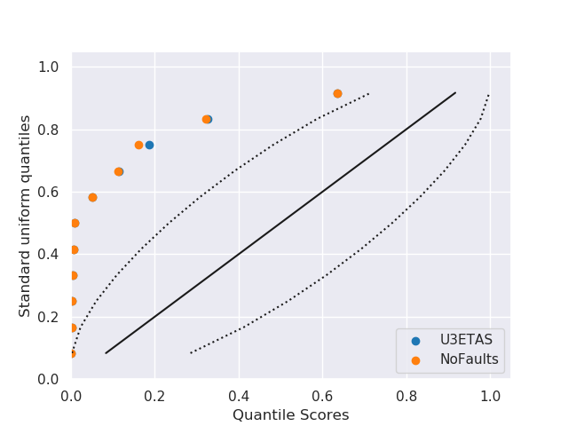
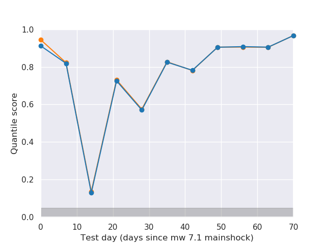
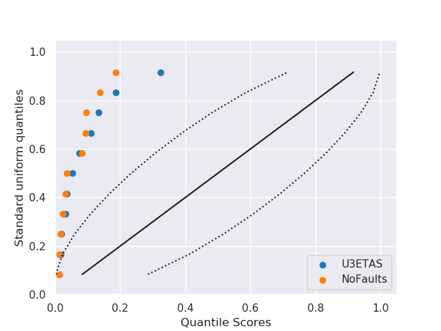

# Table of Contents
1. [Comprehensive Evaluations](#comprehensive_evaluations)
   1. [Cumulative N-Test Result](#cumulative_n-test_result)
   1. [Cumulative M-Test Result](#cumulative_m-test_result)
   1. [Cumulative L-Test Result](#cumulative_l-test_result)
   1. [Cumulative S-Test Result](#cumulative_s-test_result)
# Comprehensive Evaluations 

The following plots compare U3ETAS forecasts with the NoFaults version for about ten weeks of forecasts following the Ridgecrest sequence. For each test considered we will compare the results against the quantiles from a uniform distribution under the assumption that the p-values from independent sames of the test distribution are uniformly distributed. We also plot the p-values for each simulation in time to observe possible temporal trends.  
 
Target events with Mw > 2.5 are collected for seven days following the origin time of the forecast. Events are selected only if they occur within three fault radii from the epicenter of the mainshock of the sequence. We apply the Mc(t) model from Helmstetter et al., to account for  catalog incompleteness during the sequence.
## Cumulative N-Test Result  

| | |
| --- | --- |
|   |  |

(Left) Evaluation p-values compared against uniform distribution quantiles. If observations are consistent with the test-distribution (assuming the forecast is true) the p-values should follow an exponential distribution. (Right) P-values plotted progressively during the Ridgecrest sequence. The shaded gray regions indicate critical regions assuming α = 5%.
## Cumulative M-Test Result  

| | |
| --- | --- |
|   |  |

(Left) Evaluation p-values compared against uniform distribution quantiles. If observations are consistent with the test-distribution (assuming the forecast is true) the p-values should follow an exponential distribution. (Right) P-values plotted progressively during the Ridgecrest sequence. The shaded gray regions indicate critical regions assuming α = 5%.
## Cumulative L-Test Result  

| | |
| --- | --- |
|   |  |

(Left) Evaluation p-values compared against uniform distribution quantiles. If observations are consistent with the test-distribution (assuming the forecast is true) the p-values should follow an exponential distribution. (Right) P-values plotted progressively during the Ridgecrest sequence. The shaded gray regions indicate critical regions assuming α = 5%.
## Cumulative S-Test Result  

| | |
| --- | --- |
|   |  |

(Left) Evaluation p-values compared against uniform distribution quantiles. If observations are consistent with the test-distribution (assuming the forecast is true) the p-values should follow an exponential distribution. (Right) P-values plotted progressively during the Ridgecrest sequence. The shaded gray regions indicate critical regions assuming α = 5%.
